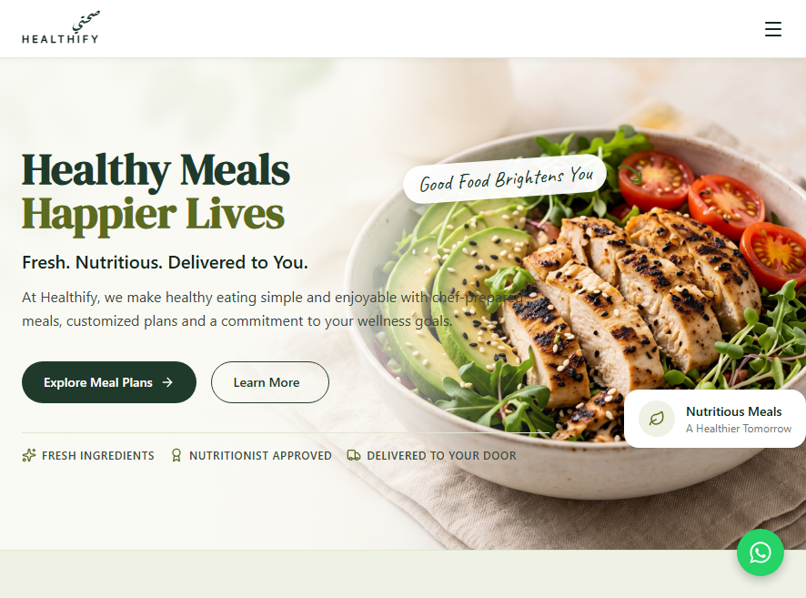

<div align="center">

# 🥗 Healthify

*Fresh, Chef-Prepared Healthy Meal Delivery Landing Page for Dubai*


<br>

Built with the tools and technologies:  


</div>

---

## 🧠 Project Summary

**Healthify** is a high-performance, responsive landing page for a premium healthy meal delivery brand operating across Dubai, UAE. It was recreated from a supplied design specification as a frontend technical assessment, with the goal of demonstrating modular UI architecture, cross-platform component design using **React Native for Web**, strict TypeScript typing, pixel-accurate design tokens, and modern accessibility practices.

**Expo** was chosen as the application framework because it simplifies web bundling, font loading, asset optimization, and static production exports while staying fully compatible with native React Native components.

All photographic assets, meal images, and avatar portraits were generated specifically for this assessment and depict fictional representations only, with no real people.

**🔗 [Try it Live on Vercel](https://healthify-web-application.vercel.app)**



---

## 🚀 Features

- 📄 **12 Landing Page Sections**
  - Sticky navigation header with live scroll-spy indicator and mobile dropdown
  - Full-bleed hero with dual-action CTAs and value proposition badges
  - Social proof stats banner with key business milestones
  - Brand story / About Us with layered visual media
  - Services showcase with custom meal delivery options and hover states
  - Core advantages grid: farm-fresh sourcing, chef curation, sustainability
  - Growth and subscription plans with pricing cards and highlighted popular tier
  - 3-step process: order, customize, daily doorstep delivery
  - Customer testimonials with star ratings and regional reviews
  - Interactive FAQ accordion with single-open expansion and keyboard navigation
  - High-impact call-to-action banner
  - 4-column footer with contact details, quick links, and social channels

- 💬 **Floating WhatsApp Button**  
  Quick-contact button with direct international messaging integration.

- 📱 **Fully Responsive**  
  Tested across mobile (320px–414px), tablet (768px–820px), and desktop (1024px–1920px) with zero horizontal overflow and a 1200px max container width.

- 🧭 **Smooth Single-Page Navigation**  
  Smooth scrolling with 64px sticky header compensation.

- ♿ **Accessibility First**  
  - Semantic landmarks (`banner`, `navigation`, `main`, `contentinfo`) and a strict `h1` → `h2` → `h3` hierarchy
  - Descriptive `aria-label` attributes on icon buttons, nav links, and the WhatsApp trigger
  - FAQ with `aria-expanded` and full keyboard support (Enter / Space)
  - Text contrast above 4.5:1 and `prefers-reduced-motion` support
  - Descriptive alt text on content images; decorative graphics hidden from assistive tech

- 🛡️ **Strict TypeScript**  
  Strict mode enabled with 100% type safety and zero `any` types.

- ⚙️ **Tech Stack Details**  
  - **Framework:** Expo (SDK 52/53, Metro bundler for web)
  - **UI:** React Native for Web (React 19)
  - **Styling:** NativeWind v4 (Tailwind CSS v3)
  - **Icons:** Lucide React Native, React Native SVG
  - **Fonts:** Expo Font (`@expo-google-fonts`: DM Serif Display, Inter, Caveat, Aref Ruqaa)
  - **Media:** Expo Image with responsive object-fit fallbacks
  - **Hosting:** Vercel static hosting with automated cache optimization

---

## 🗃️ Project Structure

```bash
healthify-web
├── assets
│   ├── favicon.png
│   ├── icon.png
│   ├── splash-icon.png
│   └── images
│       ├── About_bowl.jpg
│       ├── About_chef.jpg
│       ├── Avatar_ahmed.jpg
│       ├── Avatar_fatima.jpg
│       ├── Avatar_sara.jpg
│       ├── CTA_bg.jpg
│       ├── Hero_bowl.jpg
│       ├── Plans_promo.jpg
│       ├── Service_custom_plans.jpg
│       ├── Service_protein.jpg
│       ├── Service_ready_meals.jpg
│       └── Service_weights.jpg
├── docs
│   ├── DESIGN.md
│   ├── FEATURES.md
│   └── screenshot.png
├── src
│   ├── components
│   │   ├── cards
│   │   │   ├── AdvantageCard.tsx
│   │   │   ├── PlanCard.tsx
│   │   │   ├── PromoImageCard.tsx
│   │   │   ├── ServiceCard.tsx
│   │   │   ├── StatItem.tsx
│   │   │   └── TestimonialCard.tsx
│   │   ├── layout
│   │   │   ├── Container.tsx
│   │   │   ├── Footer.tsx
│   │   │   ├── Header.tsx
│   │   │   ├── MobileMenu.tsx
│   │   │   ├── Section.tsx
│   │   │   └── WhatsAppButton.tsx
│   │   ├── sections
│   │   │   ├── About.tsx
│   │   │   ├── Advantages.tsx
│   │   │   ├── CtaBanner.tsx
│   │   │   ├── Faq.tsx
│   │   │   ├── Hero.tsx
│   │   │   ├── Plans.tsx
│   │   │   ├── Process.tsx
│   │   │   ├── Services.tsx
│   │   │   ├── Stats.tsx
│   │   │   └── Testimonials.tsx
│   │   └── ui
│   │       ├── Badge.tsx
│   │       ├── Button.tsx
│   │       ├── CoverImage.tsx
│   │       ├── Eyebrow.tsx
│   │       ├── IconCircle.tsx
│   │       ├── Rating.tsx
│   │       ├── SectionHeading.tsx
│   │       ├── TextLink.tsx
│   │       └── WhatsAppIcon.tsx
│   ├── constants
│   │   ├── images.ts
│   │   ├── sectionIds.ts
│   │   └── theme.ts
│   ├── data
│   │   ├── advantages.ts
│   │   ├── faqs.ts
│   │   ├── footer.ts
│   │   ├── nav.ts
│   │   ├── plans.ts
│   │   ├── services.ts
│   │   ├── stats.ts
│   │   ├── steps.ts
│   │   └── testimonials.ts
│   ├── hooks
│   │   ├── useBreakpoint.ts
│   │   ├── useReducedMotion.ts
│   │   └── useScrollSpy.ts
│   ├── types
│   │   └── index.ts
│   └── utils
│       ├── formatPrice.ts
│       └── scrollToSection.ts
├── App.tsx
├── app.json
├── babel.config.js
├── global.css
├── index.ts
├── metro.config.js
├── nativewind-env.d.ts
├── package.json
├── package-lock.json
├── tailwind.config.js
├── tsconfig.json
└── vercel.json
```

---

## 🔧 Setup & Installation

> Make sure **Node.js** (v18.x or v20.x recommended) and **npm** (v9.x or higher) are installed on your system.

```cmd
:: Clone the repo
git clone https://github.com/Muhammad-Ahmed-Rayyan/healthify-web.git
cd healthify-web

:: Install required libraries
npm install

:: Run the development server
npm run dev
```

Open `http://localhost:8081` (or the port shown in your terminal) in your browser.

### 📦 Production Build

```cmd
npm run build
```

The optimized static web export is generated in the `dist` directory.

---

## 🔑 API Configuration

No environment variables are required to run, build, or deploy this project. All assets, fonts, and configurations are bundled statically, and no API keys or backend secrets are needed.

---

## ☁️ Deployment on Vercel

The project is configured for one-click deployment on Vercel:

1. Import the repository in the Vercel dashboard.
2. Configure the build settings:
   - **Framework Preset:** Other
   - **Install Command:** `npm install`
   - **Build Command:** `npm run build` (or `npx expo export --platform web`)
   - **Output Directory:** `dist`
3. Deploy.

The included `vercel.json` configures SPA rewrites to `/index.html` and sets immutable long-term caching headers (`max-age=31536000`) for static assets under `/_expo` and `/assets`.

---

<div align="center">

⭐ Like what you see? Don’t forget to star it!

</div>